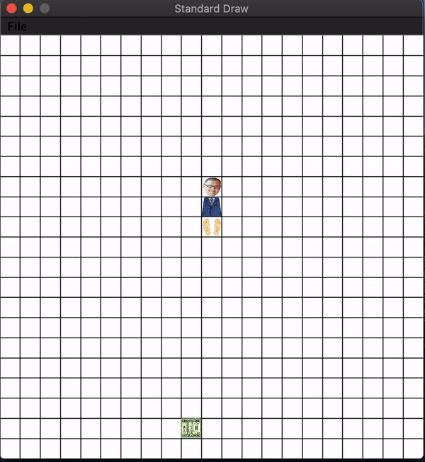

# snake_game

This is the final project for CSE131 Introduction to Computer Science: a snake game built with java.  

The console prints the state of the game as such: 

`I'm a snaaaaaaaake! HISSSSSSSSSSSssssss.....`  
`yum! you ate 1 dollars`  
`yum! you ate 2 dollars`  
`yum! you ate 3 dollars`  
`yum! you ate 4 dollars`  
`yum! you ate 5 dollars`  
`snake is dead`
